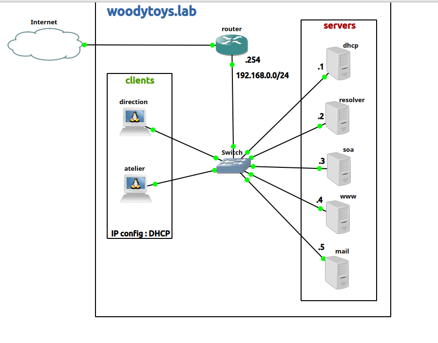

# Rapport de Troubleshooting : [Nom du Service/Labo]

**Auteur :** Kylian Mostin-Vanderplanck

**Date :** 25/11/2025

**Sujet :** Résolution des problèmes DHCP/DNS sur Woodytoys.lab exercice 1


## 1. Schéma du Labo



## 2. Description du Problème
**Symptômes observés :**
* Il manque l'autorisation pour le réseau sur le resolver


* Il n'y a pas d'allow-query donc le serveur DNS est configuré pour ne pas répondre aux inconnus mais le serveur rejette donc les demandes du client

**Contexte :**
* Machine concernée : resolver


## 3. Solution
## 3. Solution
Pour résoudre son problème on peut modifier le fichier en faisant
```bash
nano /etc/bind/named.conf.options
```
Ensuite on ajoute cette commande après le directory "/var/cache/bind";
```bash
allow-query {
                localhost;
                192.168.0.0/24;
        };
```
Maintenant ça devrai ressembler à ceci
```bash
options {
        directory "/var/cache/bind";

        allow-query {
                localhost;
                192.168.0.0/24;
        };

```
